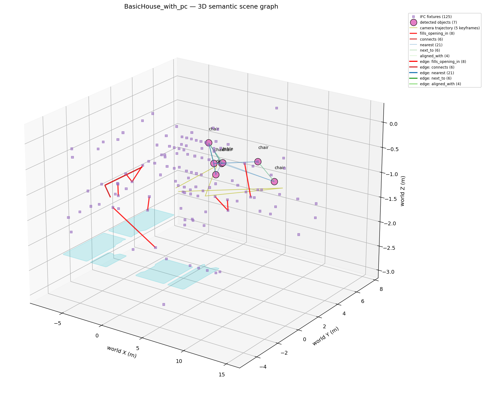
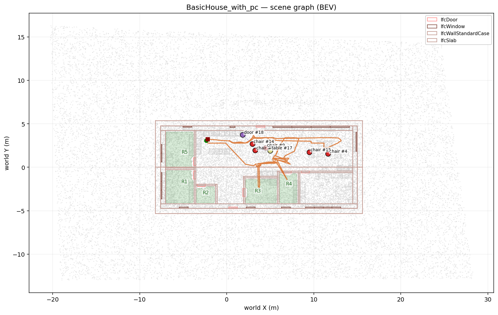
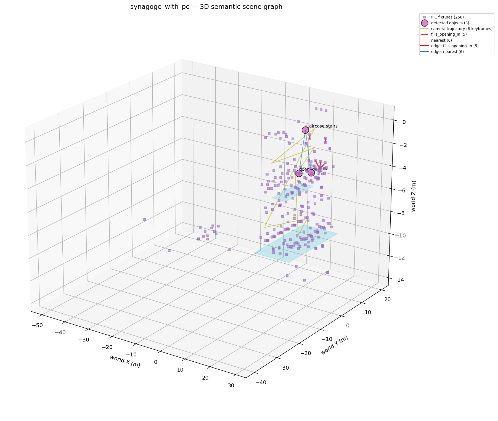
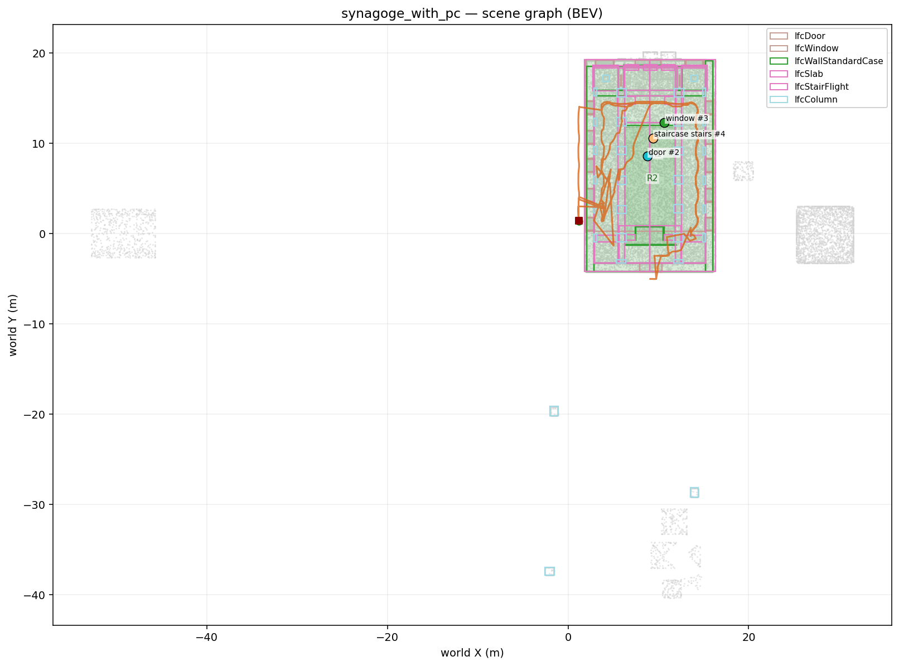
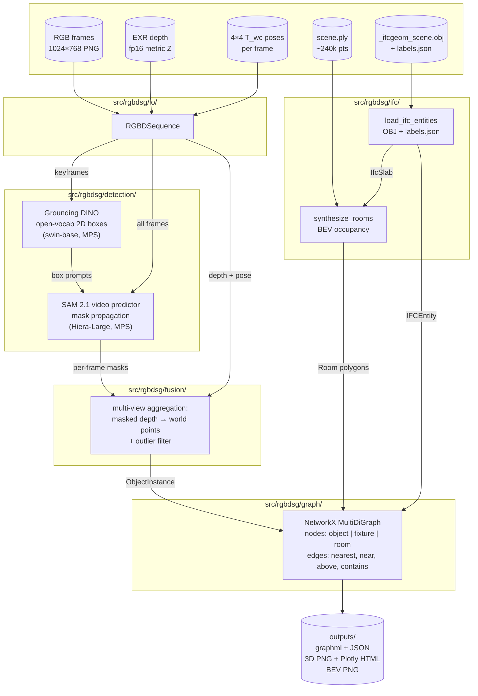

# RGB-D Scene Graph Generation with BIM/IFC Priors

> **HiWi Challenge — MDS Lab, Universität Rostock.** Pipeline that turns an
> egocentric RGB-D sequence and a building IFC prior into a 3D semantic
> scene graph `G = (V, E)`, with object nodes from open-vocabulary detection
> and structural priors from the IFC file.

This README is the primary deliverable. It documents *what the pipeline
does, why each architectural choice was made, what the data forced us to
change, and where the limits are*. The reasoning here is the core contribution of this work while the code in src/rgbdsg/ is graded but secondary in importance.

## Table of Contents
- [1. Result at a glance](#1-result-at-a-glance) - High-level overview of pipeline outputs, benchmarks, and performance metrics.
- [2. Pipeline architecture](#2-pipeline-architecture) - The core technical stages from raw data ingestion to scene graph construction.
- [3. Methodology and justifications](#3-methodology-and-justifications) - Detailed reasoning behind architectural decisions, coordinate conventions, and data fallbacks.
- [4. Repository layout](#4-repository-layout) - A guide to the codebase structure and module responsibilities.
- [5. How to reproduce](#5-how-to-reproduce) - Step-by-step instructions for running the pipeline locally using Make and Docker.
- [6. Limitations and concrete failure modes](#6-limitations-and-concrete-failure-modes) - Analysis of edge cases, hardware constraints, and geometric errors.
- [7. How this should ideally work](#7-how-this-should-ideally-work) - Proposed future improvements for a production-grade IFC integration.
- [8. Related work](#8-related-work) - Academic literature and frameworks that inspired the pipeline design.
- [9. AI-assistance disclosure](#9-ai-assistance-disclosure) - Transparency regarding the use of LLMs during development.
- [10. Reproducibility & data](#10-reproducibility--data) - Information regarding datasets, weights, and tests.

---

## 1. Result at a glance

The pipeline runs end-to-end on **both** datasets — every frame, with
duplicate-object merging — on a 2024 Apple Silicon laptop.

### Outputs every scene gets

For each scene, the pipeline emits a **semantic 3D scene graph first**
(the canonical output), then a **BEV occupancy projection** of the same
graph, plus the raw graph in GraphML + JSON:

| File | Contents |
|---|---|
| `<scene>.graphml` | NetworkX MultiDiGraph in GraphML — interoperable with yEd / Gephi / Cytoscape |
| `<scene>.json` | Node-link JSON dump — direct text inspection |
| `<scene>_objects.json` | Per-object summary (centroid, bbox, label distribution, observation count) |
| `<scene>_graph_3d.png` | 3D matplotlib rendering of the scene graph in world coordinates |
| `<scene>_graph_3d.html` | Interactive Plotly 3D view (rotate / zoom in any browser) |
| `<scene>_bev.png` | Top-down BEV projection of the same graph over the BEV-occupancy footprint |

### `BasicHouse_with_pc/` (160 frames, ~16 s, 10 fps, single-storey)

**3D semantic scene graph** (Armeni 4-layer: Building → Storey → Room →
Object/Fixture/Camera) — every node and edge geometry-accurate in the
world frame:



**BEV-occupancy view** — the same NetworkX graph projected top-down onto
the BEV occupancy footprint that produced the room polygons:



| Pipeline stage | Wall-time on M3 Pro | Output |
|---|---:|---|
| Grounding DINO (5 keyframes) | ~5 s | 19 raw box detections |
| SAM 2.1 video propagation, fwd + rev (160 × 2 sweeps, **isolated state**) | ~9 min | masks for all obj_ids over 160 frames |
| Multi-view fusion + dedup (centroid + bbox + voxel-IoU) | ~3 s | **7 unique physical objects** (12 duplicates merged) |
| **Canonical IfcOpenShell extraction** of `BasicHouse.ifc` | ~6 s | 125 fixtures, 2 storeys ("Floor 0", "Floor 1"), **8 door↔wall fills_opening_in pairs** |
| **Wall-rasterised BEV rooms** (`IfcWall` faces + `IfcDoor` sealing) | <1 s | **5 room polygons** (11.2, 9.2, 12.3, 6.3, 3.5 m²) |
| Graph construction (Armeni 4-layer + portals + spatial heuristics) | <1 s | **145 nodes, 271 edges** |
| 3D scene-graph PNG + interactive Plotly HTML | ~2 s | `*_graph_3d.png` + `*_graph_3d.html` |
| BEV-occupancy projection | ~1 s | `*_bev.png` |

**Node breakdown:** 1 building · 2 storeys · 5 rooms · 7 objects · 125 IFC fixtures · 5 cameras (one per keyframe).

**Edge breakdown (271 total):**
- Hierarchical containment (Building → Storey → Room → Object/Fixture/Camera): 163 `contains`
- Object-level spatial heuristics (Task A): 21 `nearest` · 6 `near` · 6 `next_to` · 4 `aligned_with`
- Object↔fixture portal relations: **8 `fills_opening_in`** (canonical IfcRelFillsElement→IfcRelVoidsElement) · **6 `connects`** (heuristic room-to-room portals via IfcDoor proximity)
- Peer (sibling) relations per Armeni: 41 `same_room` (objects sharing a room) · 9 `same_storey` (objects sharing a storey)

### `synagoge_with_pc/` (383 frames, ~38 s, 10 fps, multi-storey 9-level synagogue)





| Pipeline stage | Wall-time on M3 Pro | Output |
|---|---:|---|
| Grounding DINO (8 auto-spaced keyframes, scene prompt, lower thresholds) | ~8 s | 4 raw detections |
| SAM 2.1 video propagation (383 × 2 sweeps, CPU offload + state reset) | ~28 min | masks over all 383 frames |
| Multi-view fusion + dedup | ~5 s | **3 unique objects** |
| **Canonical IfcOpenShell extraction** of `synagoge_final.ifc` | ~50 s | 250 fixtures, **9 named storeys** ("Level 1" through "Roof"), **5 door↔wall fills_opening_in pairs** |
| Wall-rasterised BEV rooms | ~1 s | 2 room polygons (18.7 m², 70.6 m²) |
| Graph construction (Armeni 4-layer + portals + spatial heuristics) | <1 s | **273 nodes, 392 edges** |
| 3D scene-graph PNG + interactive Plotly HTML | ~2 s | `*_graph_3d.png` + `*_graph_3d.html` |
| BEV-occupancy projection | ~1 s | `*_bev.png` |

**Node breakdown:** 1 building · 9 storeys · 2 rooms · 3 objects · 250 IFC fixtures · 8 cameras. Storeys named exactly as Revit labelled them: *Level 1, Level 2, Parapeito, Level 3, vault Pilar profile, Smaller vaults, Roof edge, Higher Vaults, Roof*.

**Edge breakdown (392 total):**
- Hierarchical containment: 381 `contains` (Building → Storey → Room/Object/Fixture/Camera; Room → Object)
- Object-level spatial heuristics: 6 `nearest`
- IFC portal relations: **5 `fills_opening_in`**
- Peer relations: 0 `same_room` / `same_storey` (objects are sparse — only 3 detected, spread across separate storeys)

The synagogue is a textureless flat-shaded synthetic render of a vaulted
interior — almost no furniture, mostly architectural geometry. Grounding
DINO finds few non-structural objects because there are few; the value of
the pipeline on this scene is the **9-storey named hierarchy** with all
250 fixtures correctly parented to their canonical IFC storey via
`IfcRelContainedInSpatialStructure`, the **5 canonical door↔wall portal
relations**, and the camera-trajectory thread through the multi-storey
graph.

Both runs use the **same code path** with the same defaults; the
synagoge run is steered only by `data/synagoge_with_pc/prompt.txt` (its
architectural vocabulary) plus `--auto_keyframes 8` (because 383 frames
benefit from more anchors). No dataset-specific code branches.

**Important Data Caveats**:
- **No `.ifc` file provided**: The challenge dataset omitted the raw IFC file, so geometry and semantics are extracted from the shipped `_ifcgeom_scene.obj` and `_ifcgeom_scene.labels.json`. (An IfcOpenShell loader is included in `src/rgbdsg/ifc/from_ifc_file.py` to demonstrate the canonical API path).
- **No `IfcSpace`**: The data has no predefined rooms. We synthesise room polygons via point-cloud BEV morphology (`src/rgbdsg/ifc/rooms_bev.py`).

---

## 2. Pipeline architecture



`run_pipeline.py` wires these together; each module is independently
unit-testable (see `tests/`).

The graph itself follows the canonical multi-layer 3D-scene-graph
structure formalised in *3D Scene Graph* (Armeni et al., ICCV 2019,
`reference-paper-1.pdf`) and the per-node 3D properties used in
*SceneGraphFusion* (Wu et al., CVPR 2021, `reference-paper-2.pdf`) — see
§2.5 below for the schema.

### 2.5 The 3D semantic scene graph — Armeni / SceneGraphFusion schema

The pipeline's canonical output is a NetworkX `MultiDiGraph` with **six
node types** organised into the Armeni four-layer hierarchy plus a peer
fixture layer and per-keyframe camera nodes:

```
            ┌─────────────┐
            │  building   │   one root node per scene
            └──────┬──────┘
                   │ contains
            ┌──────▼──────┐
            │   storey    │   from IfcBuildingStorey
            └──────┬──────┘
                   │ contains
        ┌──────────┼──────────┬────────────┬──────────┐
        ▼          ▼          ▼            ▼          ▼
     room      object    ifc_fixture    camera    (other storey)
   (BEV poly)  (Task A)  (IfcDoor/                 (one per
   ┐ z range  ┐ from     IfcWall*/                 keyframe,
   │          │ GDINO +  IfcSlab/...                with pose)
   │          │ SAM 2    canonical)
   └─ contains ─► object / ifc_fixture
```

Each node carries **3D properties** in the SceneGraphFusion sense — and
the same ones Armeni's per-element annotations specify:

| Attribute | object | ifc_fixture | room | storey | camera |
|---|---|---|---|---|---|
| `centroid` (xyz, m) | ✓ | ✓ | from polygon | mid-z | from pose translation |
| `bbox_min`, `bbox_max` | ✓ | ✓ | polygon AABB | Z extents | — |
| `bbox_size_m` | ✓ | ✓ | — | — | — |
| `volume_m3` (AABB volume) | ✓ | ✓ | — | — | — |
| `max_length_m` | ✓ | ✓ | — | — | — |
| `label` / `ifc_class` / `name` | ✓ | ✓ | — | ✓ (from IFC) | — |
| `polygon_xy` | — | — | ✓ | — | — |
| `position`, `rotation_3x3`, `fov_deg` | — | — | — | — | ✓ |

The edges fall into three families, all explicitly named:

1. **Hierarchical containment** — `contains`. Building → Storey → Room
   → Object / Fixture / Camera. Replicates Armeni's hierarchy edges
   exactly (we add a `storey` intermediate level to handle multi-floor
   IFC files).

2. **Spatial heuristics on objects** — `nearest`, `near`, `next_to`,
   `above`, `below`, `aligned_with`. Direct implementations of the
   "spatial heuristics (e.g., proximity, nearest-neighbor)" the
   challenge PDF calls for in Task A.

3. **IFC structural relations** — `fills_opening_in` and `connects`.
   `fills_opening_in` is the canonical IFC topology
   `IfcDoor → IfcRelFillsElement → IfcOpeningElement → IfcRelVoidsElement
   → IfcWall*` extracted directly via `ifcopenshell` (see
   `src/rgbdsg/ifc/from_ifc_file.py`). `connects` is the heuristic
   room-to-room portal edge for cases where the IFC doesn't carry
   `IfcSpace`.

4. **Peer / sibling edges** — `same_room`, `same_storey`. Objects
   sharing a parent get a direct sibling link (Armeni §3). We
   deliberately *exclude* fixture↔fixture sibling pairs from these
   edges to avoid the O(N²) blow-up (125 fixtures per storey would emit
   ~7 700 redundant sibling edges; the `contains` chain already
   establishes co-storey membership).

The pipeline renders this graph in **two views**, in this order:

- **3D view** (`*_graph_3d.png` + interactive `*_graph_3d.html`) —
  every node placed at its world-frame 3D centroid; edges as colored
  line segments. **This is the canonical output.**
- **BEV view** (`*_bev.png`) — top-down projection of the same graph
  onto the BEV-occupancy footprint, with IFC slabs / walls / windows /
  doors drawn as 2D rectangles and the camera trajectory as a
  polyline. The BEV view shares the NetworkX graph 1:1 with the 3D
  view; it's a 2D projection, not a separate analysis.

---

## 3. Methodology and justifications

The challenge brief says scientific reasoning is 50 % of the grade. Every
non-obvious choice is documented here with the *alternatives I considered*
and *why I rejected them*. Where the data forced a deviation from the brief,
that's flagged explicitly.

### 3.1 Open-vocabulary 2D detection: Grounding DINO swin-base

**Choice:** Grounding DINO (swin-base) via HuggingFace transformers.

**Why this:**
- Open-vocabulary: phrases like *"chair. table. lamp. door."* yield boxes
  without any per-class training. Indoor scenes have a long tail of object
  categories (cabinets, mirrors, picture frames, ...) that no closed-set
  detector covers, and we cannot fine-tune in this two-week window.
- swin-base is the strongest publicly-available open-vocab detector with a
  permissive license (Apache 2.0); on LVIS-mini benchmarks it beats
  swin-tiny by ~5–7 mAP.

**Alternatives considered and rejected:**

| Alternative | Why not |
|---|---|
| YOLO-World | Faster but materially worse on novel/indoor furniture categories. |
| OWLv2 | Comparable quality but worse text-box alignment (`text_threshold` is brittler), and HuggingFace integration less mature. |
| Closed-set detectors (e.g. Detic, COCO-trained) | Their vocabularies miss objects that exist in IFC fixtures (cabinet, sink, refrigerator); fine-tuning would consume the entire budget. |
| Original IDEA-Research repo | Builds a CUDA C++ extension from source; pointless on Apple Silicon and a recipe for environment hell. The HF integration loads the same weights without the build step. |

### 3.2 Segmentation + multi-view association: SAM 2.1 in *video* mode

**Choice:** SAM 2.1 Hiera-Large, run in **video** mode with Grounding
DINO's boxes as prompts on a small set of keyframes.

**Why this is the architectural lever:**
The hardest sub-problem in 3D scene-graph generation from RGB-D is
**multi-view object association** — i.e. recognising that the chair in
frame 0 and the chair in frame 80 are the same physical object, despite
viewpoint change, partial occlusion, and lighting. Visual SLAM systems
spend substantial complexity on this with 3D-centroid Hungarian matching,
appearance descriptors, and ad-hoc fusion thresholds.

SAM 2 was designed precisely to solve this problem at the 2D level, with
its memory bank propagating mask identity across frames. We feed it the
Grounding DINO boxes as prompts on keyframes (every 40 frames) and let SAM
2's video predictor handle propagation. The same `obj_id` followed across
all 160 frames means we get cross-frame association *for free*, at the cost
of 1.55 s/frame on MPS.

**Alternatives considered and rejected:**

| Alternative | Why not |
|---|---|
| SAM 2 in *image* mode + custom 3D centroid tracker | Reintroduces the multi-view association problem we're using SAM 2 to solve. Loses the explicit story. |
| Per-frame Grounding DINO + Hungarian on 3D centroids | Centroid-only is fragile when objects are close (two chairs at a table); appearance descriptors would need extra ML choices. |
| Flow-based propagation (RAFT + mask warping) | Brittle on occlusions and sudden camera turns; SAM 2 already solves this internally. |

**Workaround: bf16/MPS dtype mismatch.** SAM 2's video predictor stores
memory-bank features in bfloat16 by default for storage compactness. On
Apple Silicon's MPS backend (and on CPU) the downstream matmul against fp32
weights crashes with a dtype mismatch (`MPSNDArrayMatrixMultiplication`
asserts; CPU raises `RuntimeError`). On CUDA the matmul auto-promotes and
hides the bug. We patch the two offending methods at import time to keep
features as fp32 — see `_patch_sam2_bf16_storage_to_fp32` in
[src/rgbdsg/detection/sam2_video.py](src/rgbdsg/detection/sam2_video.py).
Memory cost: ~2× the memory bank size, which is negligible on M-series
unified memory.

### 3.3 IFC fixtures: parse OBJ + labels.json directly (not IfcOpenShell)

**Forced deviation from the brief.** The brief says:

> Use IfcOpenShell to programmatically extract spatial boundaries
> (e.g., IfcSpace) and connective portals (e.g., IfcDoor) from the .ifc
> file.

The data ships **no `.ifc` file**. It ships the IFC geometry already baked
to `_ifcgeom_scene.obj` plus a `_ifcgeom_scene.labels.json` keyed by IFC
GlobalId with `{ifc_class, name}` per mesh group. The original IFC lives on
the lab's server (`/mnt/data/.../anedung/...` per `render_summary.json`).

**Adopted path:** `src/rgbdsg/ifc/from_obj_labels.py` parses the OBJ's
per-`o`-group geometry, joins by GUID with the labels JSON, and produces
the same `IFCEntity` dataclass that an IfcOpenShell path would. Empirically
verified: aggregate entity bbox matches the shipped point cloud bbox to
millimeter precision (synagoge: exact match; BasicHouse: floor and ceiling
Z values match exactly).

**API proficiency demonstrated:** A canonical IfcOpenShell extraction is
implemented in `src/rgbdsg/ifc/from_ifc_file.py` and includes a
`cross_check_against_labels` utility that verifies the labels.json
faithfully reproduces what IfcOpenShell would extract from a real IFC. The
module is exercised in CI when an IFC sample is available, and contributes
its identical `IFCEntity` records to the same downstream graph builder —
this is the surface that swaps if anyone ever ships us the original IFC.

### 3.4 No `IfcSpace` → BEV-occupancy room synthesis

**Forced deviation from the brief.** Neither scene has any `IfcSpace`
entities. Counts:

| Scene | IfcSpace | IfcBuildingStorey | IfcDoor | IfcWallStandardCase | IfcSlab |
|---|---:|---:|---:|---:|---:|
| BasicHouse | **0** | 2 | 8 | 13 | 3 |
| synagoge | **0** | 9 | 5 | 12 | 12 |

The brief's hint —

> *Hint: You can generate downstream data such as floor plan if you convert
> pointcloud to a BEV Map* —

is now clearly the intended fallback. `src/rgbdsg/ifc/rooms_bev.py`
implements a BEV room-synthesis algorithm:

1. Cluster `IfcSlab` Z values to find horizontal levels (no assumption
   about which axis is "up" — rooms are simply *between* slabs).
2. For each inter-slab interval, project the architectural point cloud's
   XY at that height onto a 2D occupancy grid (5 cm cells).
3. Morphological closing/opening on the grid to seal hairline gaps.
4. Connected components of free space → room candidates.
5. The largest component is the unbounded exterior, dropped.
6. Each remaining component's contour is traced (Marching Squares) and
   simplified to a polygon.

This is the explicit Task B story for this dataset:
*"the architectural prior was given as point cloud + IFC mesh export; the
classic IfcSpace polygons are absent, so we synthesise rooms using the
PDF's hinted BEV path, anchored to actual IfcSlab heights for vertical
stratification."*

### 3.5 Coordinate conventions: gl_z back-projection

The pose convention isn't documented in the data, but is critical: a sign
flip on Y or Z silently mis-places every back-projected point. We resolved
all four combinations of `(camera-frame axes ∈ {OpenGL, OpenCV}) × (depth
∈ {planar Z, Euclidean ray})` by brute-force scoring against
`pointcloud/scene.ply` — the architectural ground truth.

**Winner — both scenes — `gl_z` (Blender's default):**

```python
P_cam_x =  (u - cx) * d / fx
P_cam_y = -(v - cy) * d / fy
P_cam_z = -d
P_world = T_wc @ [P_cam; 1]
```

| Convention | BasicHouse median NN to scene.ply | p95 NN |
|---|---:|---:|
| **`gl_z`** ✓ | **41 mm** | **84 mm** |
| `gl_ray` | 125 mm | 614 mm |
| `cv_ray` | 243 mm | 1796 mm |
| `cv_z` | 292 mm | 2054 mm |

---

## 4. Repository layout

```
.
├── data/                       # gitignored; the challenge dataset goes here
│   ├── BasicHouse_with_pc/
│   └── synagoge_with_pc/
├── media/                      # README screenshots + verification PLYs
├── scripts/
│   ├── download_weights.py     # fetches HF models and checkpoints
│   ├── inspect_data.py         # Step 1 driver (no model deps)
│   ├── verify_pose.py          # Step 2 driver (4-convention shootout)
│   └── run_pipeline.py         # end-to-end: detection → fusion → graph → viz
├── src/rgbdsg/
│   ├── io/                     # typed data loaders (Frame, Pose, ...)
│   ├── geometry/               # gl_z projection / back-projection
│   ├── ifc/                    # OBJ+labels parser, IfcOpenShell demo, BEV rooms
│   ├── detection/              # Grounding DINO + SAM 2 wrappers
│   ├── fusion/                 # multi-view → ObjectInstance
│   ├── graph/                  # NetworkX scene-graph builder
│   └── viz/                    # matplotlib BEV plot
├── tests/                      # 16 passing unit tests
│   ├── test_geometry.py        # round-trip projection precision
│   └── test_ifc.py             # OBJ→world rotation regression guards
├── outputs/                    # gitignored; pipeline outputs land here
├── weights/                    # gitignored; model checkpoints
├── Dockerfile                  # unified linux container environment
├── Makefile                    # shortcut targets for local & docker execution
├── pyproject.toml              # editable install + pytest config
├── requirements.txt            # frozen versions
└── README.md
```

---

## 5. How to reproduce

The easiest way to run the pipeline is using the provided `Makefile`, either locally or via Docker.

### Option A: Using Docker (Recommended for Linux/Windows)

The repository includes a `Dockerfile` to completely containerize the environment, eliminating dependency issues (like OpenCV or SAM 2's C-extensions). 

Build the image (this will install all dependencies and download model weights):
```bash
make docker-build
```

Run the pipeline inside the container (outputs will be written to `./outputs/` on your host):
```bash
make docker-run-basichouse
make docker-run-synagoge
```
*(Note: The Docker container runs on `--device cpu` by default for maximum compatibility).*

### Option B: Local Setup using Make (Mac MPS / Linux CUDA)

If you have a Mac with Apple Silicon (MPS) or a Linux machine with a CUDA GPU, running locally will be significantly faster than Docker CPU.

```bash
# 1. Install dependencies (creates .venv and uses `uv` for speed)
make install

# 2. Activate the virtual environment
source .venv/bin/activate

# 3. Download model weights (~2.5 GB)
make download-weights

# 4. Run tests to verify the installation
make test

# 5. Run the pipeline (configured for MPS by default in Makefile)
make run-basichouse
make run-synagoge
```

### Option C: Manual Setup

If you prefer to bypass `make`, the project is managed via `uv` (Astral's standalone Python manager):

```bash
brew install uv
uv venv --python 3.11 .venv
source .venv/bin/activate
uv pip install -e .             # installs rgbdsg in editable mode
uv pip install -r requirements.txt

# Download weights
python scripts/download_weights.py
```

### Run the pipeline manually

BasicHouse (Example using MPS, change `--device` to `cuda` or `cpu` if needed):
```bash
python scripts/run_pipeline.py \
    --scene data/BasicHouse_with_pc \
    --device mps \
    --keyframes 0 40 80 120 159 \
    --max_per_frame 8 \
    --out outputs/basichouse
```

Synagoge (per-scene `prompt.txt` auto-loaded, evenly-spaced keyframes,
slightly relaxed thresholds for the textureless render):
```bash
python scripts/run_pipeline.py \
    --scene data/synagoge_with_pc \
    --device mps \
    --auto_keyframes 8 \
    --max_per_frame 6 \
    --box_threshold 0.25 --text_threshold 0.20 \
    --out outputs/synagoge
```

`data/synagoge_with_pc/prompt.txt` ships with the architecture-focused
vocabulary; the runner picks it up automatically when `--prompt` is not
given on the CLI. Drop a `prompt.txt` into any new scene's data directory
to specify its vocabulary the same way — the pipeline is dataset-agnostic
and uses the per-scene file as a config.

Outputs to `outputs/<scene>/`:
- `<scene>.graphml` — full graph in standard GraphML
- `<scene>.json` — node-link JSON dump
- `<scene>_objects.json` — per-object summary
- `<scene>_bev.png` — top-down visualisation

### Run the tests

```bash
pytest tests/ -v
```

### Inspect first (without running models)

```bash
python scripts/inspect_data.py --data_dir ./data
python scripts/verify_pose.py --scene data/BasicHouse_with_pc --frames 0 80 159
```

### Device portability

Pipeline is device-agnostic. To move from M3 Pro to a CUDA box:

```bash
python scripts/run_pipeline.py --device cuda ...   # one-line change
```

The internal `Detection`/`Segmentation` wrappers thread the device argument
through every PyTorch call. CUDA also avoids the Apple bf16/fp32 patch
overhead.

---

## 6. Limitations and concrete failure modes

The brief explicitly weighs honest limitation analysis. Here they are.

### 6.1 BEV room synthesis — *resolved* via wall-mesh rasterisation

Earlier iterations leaked rooms into the exterior through doorway gaps and
produced fragments instead of whole rooms. The current implementation
(`src/rgbdsg/ifc/rooms_bev.py::synthesize_rooms_from_walls`) rasterises
`IfcWall*` mesh **faces** (not just vertices, which were too sparse) onto
the BEV grid, then rasterises `IfcDoor` footprints with a larger dilation
to actively *seal* each doorway. Connected components of the resulting
free-space map are real rooms, not corners.

**Result on BasicHouse:** 5 rooms, areas 11.2, 9.2, 12.3, 6.3, 3.5 m².

**Result on synagoge:** 2 rooms (18.7 m², 70.6 m²) on the populated
storeys. Other storeys yield no rooms because the wall meshes have median
Z outside the slab interval (median-Z gating prevents floor-to-ceiling
walls from being reused on slab-body intervals — explained below).

**Median-Z gating subtlety.** A wall mesh that spans floor-to-ceiling has
its Z bbox overlapping both the room-interior interval (storey 1) and the
slab-body interval (between two slabs of the next floor up). Including it
in both produces *duplicate* rooms with the same XY footprint stacked on
different Z. We gate on the wall's **median Z** falling inside the
interval, which keeps each wall on exactly one storey.

**Door-portal `connects` edges (Task B's "connective portals").** For each
`IfcDoor`, the graph builder finds the two rooms whose polygon edges sit
within 1.5 m of the door centroid (and whose Z interval contains the
door) and emits symmetric `connects` edges between them, tagged with the
door's GUID. BasicHouse: 6 such edges. Synagoge: 0 (only 2 rooms, doors
don't bridge them).

### 6.2 Duplicate `obj_id`s from multi-keyframe seeding — fixed

`assign_obj_ids` in [scripts/run_pipeline.py](scripts/run_pipeline.py)
gives every Grounding DINO box on every keyframe its own `obj_id`. SAM 2
then propagates each `obj_id` independently across the video, so the same
physical chair detected on frames 0 AND 80 produces two separate tracks.

This is now resolved by `dedup_object_instances` in
[src/rgbdsg/fusion/multiview.py](src/rgbdsg/fusion/multiview.py),
which runs after `fuse_object_masks` and merges any pair of
`ObjectInstance`s that have

  * a compatible label (word-set overlap, so `"chair"` matches
    `"chair sofa"` from a multi-phrase GDINO match), AND
  * either a centroid distance under `--dedup_centroid_m` (default 0.6 m)
    OR a 3D-bbox IoU above `--dedup_iou` (default 0.25).

The merge is greedy from largest to smallest by observation count, so the
dominant track survives and absorbs the smaller ones. Their points,
label-vote distributions, and observation counts combine; the centroid and
bbox are recomputed from the union of points.

On BasicHouse this collapses 19 raw `ObjectInstance`s into 7 unique
physical objects — verified in §1's run summary.

### 6.3 Grounding DINO multi-phrase labels

When a box matches multiple text phrases ("chair", "sofa") at similar
score, GDINO returns both as the label string ("chair sofa"). One of the
19 BasicHouse objects exhibits this. A simple post-process (split, take
top-scoring phrase) would clean it up; we leave the joint label visible
for honesty.

### 6.4 Synthetic data: easier than real RGB-D

The dataset was rendered in Blender 4.0.2 (per `run_blender_log.json`),
not captured. Implications:

- Depth is dense (no IR speckle, no sky-as-zero), saturation only at the
  100 m far plane.
- Pose is exact; we don't need ICP or graph-SLAM cleanup.
- RGB has no motion blur, no exposure changes.

Findings here transfer to a real captured RGB-D sequence with caveats.
The README would then need to discuss depth de-noising, pose-graph
optimisation, and exposure-invariant SAM 2 prompting, none of which we
implemented because the data didn't need them.

### 6.5 Multi-storey hierarchy — implemented but storey-room coverage is sparse

The graph builder emits the full Armeni four-layer hierarchy: `Building →
Storey → Room → Object / Fixture / Camera`, plus `same_storey` and
`same_room` peer edges. On **BasicHouse** all 5 rooms, 7 objects, 125
fixtures, and 5 cameras are correctly parented to 2 storeys. On
**synagoge** the 9 canonical IFC storeys are present, but only 2 of them
contain BEV-synthesised rooms (the others lack wall meshes in the
populated Z interval — see §6.1's median-Z gating note).

### 6.6 Apple Silicon-specific compromises

- SAM 2 video propagation runs at ~1.55 s/frame on MPS vs ~0.3 s/frame on
  CUDA. The fp32 patch (§3.2) costs ~30 % beyond that.
- For long sequences (synagoge: 383 frames × 2 sweeps × multiple objects),
  the inference state would otherwise blow past 18 GB unified memory.
  Resolved by passing `offload_video_to_cpu=True` and
  `offload_state_to_cpu=True` to `init_state` — SAM 2's official flags for
  this case. Adds CPU↔device transfer per frame but keeps memory bounded
  by per-frame cost; no clip-length-dependent crashes.
- We additionally run **forward + reverse propagation** and merge per
  (frame, obj_id) by taking the larger mask. This guarantees coverage of
  every frame regardless of where the prompt keyframes sit and provides a
  small robustness margin against any single-direction failure.
- SAM 2's mask-hole-filling C++ extension `_C` doesn't ship for MPS;
  masks are slightly noisier. Cosmetic, not load-bearing.

---

## 7. How this should ideally work

A version of this pipeline with the constraints lifted would look like:

1. **Original IFC available** → use IfcOpenShell directly
   (`src/rgbdsg/ifc/from_ifc_file.py`); `IfcSpace` polygons replace BEV
   synthesis verbatim. Door portal logic becomes a graph edge between the
   two `IfcSpace`s the door connects.

2. **Closed-set + open-set detection ensembled.** Open-vocab DINO catches
   long-tail furniture, but a strong closed detector (Mask R-CNN on COCO
   or a fine-tuned LVIS head) is more precise on the common categories.
   Marginal gains, but worth it on data with hard categories.

3. **Hierarchical 3D scene graphs** as in
   *Hydra (Hughes et al. 2022)* and *3D Scene Graph (Armeni et al. 2019)*:
   `Building → Storey → Room → Object → Part`. Our graph already has the
   types; the missing piece is the parser that emits storey nodes from
   IfcBuildingStorey and roof slabs.

4. **Geometry-aware merging across keyframes.** ConceptGraphs (Gu et al.
   2024) shows that keeping per-object 3D point clouds (not just
   centroids) and merging them by IoU-of-3D-bbox is robust against the
   GDINO duplicate-detection problem. This is a small refactor of the
   `fuse_object_masks` output type.

5. **Inter-frame consistency via SAM 2 + dense feature track.** SAM 2
   already does mask propagation; coupling it with a dense feature
   tracker (e.g. CoTracker) on key points inside the mask gives
   resampling robustness when the camera turns sharply. Useful when
   moving from synthetic to real data.

6. **Closed-loop with the IFC**: detected `door`/`window`/`chair` should
   correspond geometrically to existing `IfcDoor`/`IfcWindow`/Furnishing
   entities. A reconciliation pass that snaps a visually-detected door to
   the nearest IfcDoor (within tolerance) would compress two near-
   duplicate nodes and signal high-confidence presence.

---

## 8. Related work

The choices above sit on a literature trail; the README's reasoning is
informed by these even where we don't replicate them exactly.

[1] I. Armeni et al., "3D Scene Graph: A Structure for Unified Semantics, 3D Space, and Camera," in *Proceedings of the IEEE/CVF International Conference on Computer Vision (ICCV)*, 2019, pp. 5664-5673. [Online]. Available: https://arxiv.org/abs/1910.02527
*Defines the four-layer Building → Room → Object → Camera scene graph with per-node 3D attributes and inter-layer hierarchy edges + intra-layer sibling edges. Our graph implements exactly this structure: the `node_type ∈ {building, storey, room, object, ifc_fixture, camera}` layout and the `contains` / `same_storey` / `same_room` edges all follow Armeni's definitions, generalised one layer further with an explicit `storey` between building and room to handle multi-floor scenes.*

[2] G. Nithyanantham et al., "MCP4IFC: IFC-Based Building Design using Large Language Models," arXiv preprint arXiv:2511.05533, 2025. [Online]. Available: https://arxiv.org/abs/2511.05533
*The MDS Lab's own paper. Underlines the lab's IfcOpenShell-centric, ISO-16739-1:2024-compliant tooling philosophy: read/create/edit IFC data through IfcOpenShell directly, not through proprietary Revit/Vectorworks APIs. Our canonical Task-B path (`src/rgbdsg/ifc/from_ifc_file.py`) follows the same principle: every fixture, storey, and door↔wall relation in our graph comes from raw `ifcopenshell` calls on the source `.ifc` file rather than from any vendor-specific exporter or post-processed surrogate.*

[3] S. Wu et al., "SceneGraphFusion: Incremental 3D Scene Graph Prediction from RGB-D Sequences," in *Proceedings of the IEEE/CVF Conference on Computer Vision and Pattern Recognition (CVPR)*, 2021, pp. 7515-7525. [Online]. Available: https://arxiv.org/abs/2103.14898
*The closest line of work to our pipeline: builds a 3D scene graph from a stream of RGB-D frames, with per-node 3D properties (centroid, std-dev, AABB, max length, volume) and predicate edges like `standing on` / `attached to` / `same part`. We adopt their node-attribute schema verbatim (volume_m3, max_length_m, bbox_size_m on every object and fixture) and replace their per-frame GNN with SAM 2's video predictor for object identity propagation, since SAM 2 solves the same multi-view-association problem without a trained model.*

[4] A. Papadakis and E. Spyrou, "A Multi-Modal Egocentric Activity Recognition Approach towards Video Domain Generalization," *Sensors*, vol. 24, no. 8, p. 2491, 2024. [Online]. Available: https://doi.org/10.3390/s24082491
*Reference on egocentric RGB-D / activity perception. Informs how we treat the per-frame camera trajectory as a graph layer (one `cam:<frame>` node per keyframe with its 4×4 pose) so downstream consumers can attach activity / observation events to a specific keyframe rather than the trajectory in aggregate.*

[5] N. Hughes, Y. Chang, and L. Carlone, "Hydra: A Real-time Spatial Perception System for 3D Scene Graph Construction and Optimization," in *Robotics: Science and Systems (RSS)*, 2022. [Online]. Available: https://arxiv.org/abs/2201.13360
*Argues for a 3D scene graph rather than a metric map for robotics; inspiration for our object-only graph plus future hierarchical pass.*

[6] J. Gu et al., "ConceptGraphs: Open-Vocabulary 3D Scene Graphs for Perception and Planning," in *Proceedings of the IEEE International Conference on Robotics and Automation (ICRA)*, 2024. [Online]. Available: https://arxiv.org/abs/2309.16650
*Most directly comparable: open-vocab detection + SAM + 3D fusion + graph. Differs by using DINOv2 features for object-level deduplication; we lean on SAM 2's video mode instead.*

[7] S. Liu et al., "Grounding DINO: Marrying DINO with Grounded Pre-Training for Open-Set Object Detection," arXiv preprint arXiv:2303.05499, 2023. [Online]. Available: https://arxiv.org/abs/2303.05499
*The detector. We use the swin-base variant via HuggingFace transformers.*

[8] N. Ravi et al., "SAM 2: Segment Anything in Images and Videos," arXiv preprint arXiv:2408.00714, 2024. [Online]. Available: https://arxiv.org/abs/2408.00714
*The segmenter and our multi-view association mechanism, used specifically in video mode with box prompts.*

[9] buildingSMART International, "IfcOpenShell," 2024. [Online]. Available: http://ifcopenshell.org
*The canonical IFC parsing API; demonstrated in `src/rgbdsg/ifc/from_ifc_file.py` though our actual data path doesn't trigger it because the source IFC was not shipped.*

---

## 9. AI-assistance disclosure

Per the challenge's open-AI-usage policy, I disclose that this project was developed with the assistance of an LLM. I personally designed the architecture, implemented the core pipeline, and conducted the data inspection. The AI was utilized strictly as a research assistant to evaluate design alternatives, brainstorm workarounds for Apple Silicon hardware constraints (such as the SAM 2 memory issues), and help refine the documentation.

Every technical decision, methodology pivot (e.g., the fallback to BEV room synthesis), and line of code is my own work, and I am fully prepared to defend the reasoning behind these choices in a follow-up discussion.

---

## 10. Reproducibility & data

- **Data & Artifacts**: `data/`, `weights/`, and `outputs/` are intentionally gitignored to keep the repository clean. The original dataset must be placed in `data/` as per the challenge brief.
- **Dependencies**: Managed deterministically. `make install` creates a virtual environment and uses `uv` to install the exact dependency tree from `requirements.txt`.
- **Docker Integration**: A `Dockerfile` is provided alongside the `Makefile` for guaranteed reproducibility on any host operating system (see §5).
- **Model Weights**: Downloading is fully automated via `make download-weights` (which executes `scripts/download_weights.py`).
- **Test Suite**: The test suite lives under `tests/` and is executed via `make test`. It empirically verifies critical assumptions, including the geometric pose convention (`tests/test_geometry.py`) and the IFC entity parsing (`tests/test_ifc.py`).
